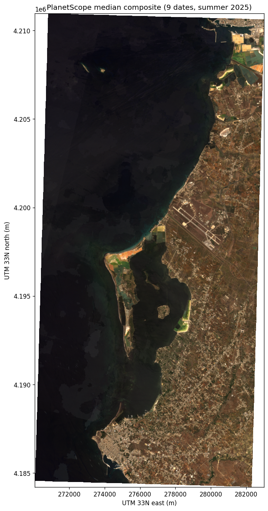
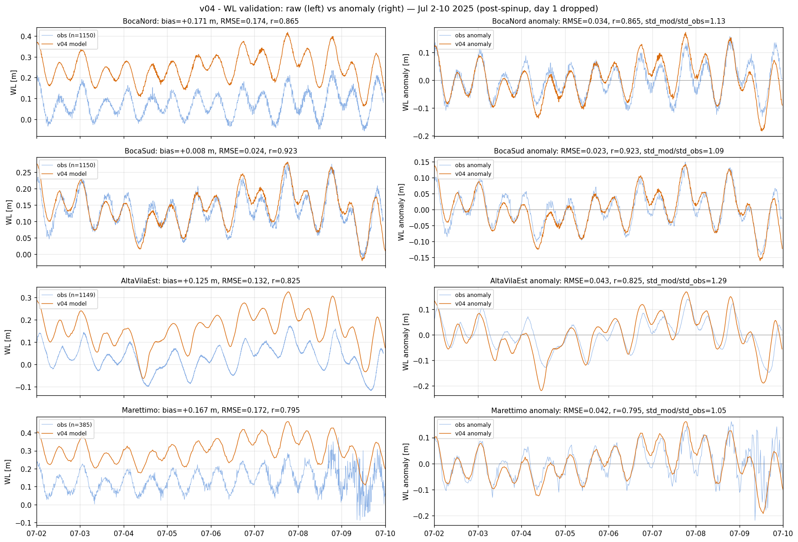
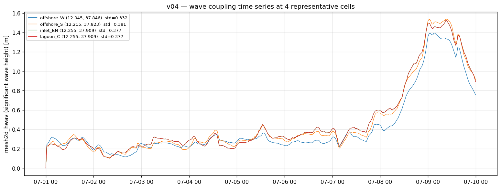
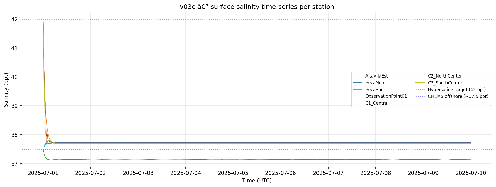
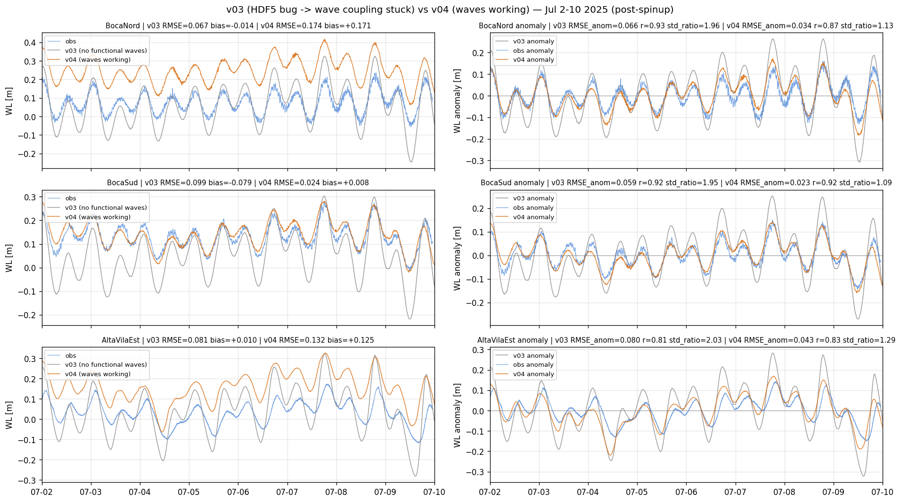

# Stagnone di Marsala — Digital Twin

3D coupled wave-hydrodynamic Delft3D FM + SWAN digital twin of the Stagnone di Marsala lagoon (Sicily, Italy). PhD project at the Università degli Studi di Palermo, with execution on local Windows workstations and the simit-server Linux HPC (IntelMPI, 2.5× speedup vs Windows).

<p align="center">
  <br/>
  <em>PlanetScope SuperDove 8-band median composite, 9 dates Jun–Sep 2025, 3 m GSD. Lagoon (centre-left), Trapani airport + city (top), western Sicily coastline.</em>
</p>

## Status (June 2026)

| Area | Status |
|------|--------|
| Mesh + bathymetry | Complete — v04 mesh (21 k nodes); EMODnet 2024 Trapani port patch (172 → 85 emerged nodes); `mesh2d_face_z` for D-Morph |
| Input forcing | ERA5+in-situ blended (AE station only) wind; CMEMS time-varying wave BCs; hypersaline init; ERA5 evap; uxuyadvectionvelocitybnd for offshore stability |
| v01–v03d | Complete and archived |
| **v04AE** | **Current primary validated model** — 9-day Jul 2025, AE-only wind blend, 8 MPI (~9 h wall). WL anomaly RMSE 2.3–4.3 cm. Drifter LW skill 0.570 (12 deploys, EP 566 m). |
| **v04AE_vr** | **VR variant validated** — Baptist canopy drag from Maltese 2025 seagrass classification (2023 epoch). Reduces WL setup bias 11–13 cm at BN/AE; drifter improvement in seagrass areas. |
| Continuation runs | **Operational** — Jul 1–20 stable; N−2 restart chain workflow; `v04AE_d10d12` as reference window (corr 0.98/0.90/0.36 at BN/BS/AE vs CMEMS anfc) |
| Offshore validation | Marettimo JRC TAD 658 — annual mean δ = +0.4489 m (13 months); per-node spatial spread via CMEMS MDT; v04AE_vr residual bias +5–6 cm at BN/AE |
| Satellite roughness | RF classification (Planet Aug 2023, Maltese 2025 method), 4 classes, OOB ≈ 0.92. Applied to FM via `.arl` trachytope (WGS84 CRS). |
| Satellite bathymetry (SDB) | Lyzenga + ELC pipeline established; Aug 2023 vs Aug 2025 Δz dominated by radiometric offset; multi-epoch approach needed |
| Particle tracking | LW skill 0.570, EP 566 m (12 deploys Jul 2025); D7 east-boundary bias resolved with AE-only wind blend |
| Morphology | D-Morph 2 fractions functional but TcrEro=0.1 unphysical (Δbl=2.4 m/9d); **disabled** in operational runs (`Sedimentmodelnr=0`); to be recalibrated in v05 |
| WetWise portal | Prototype operational — Leaflet single-map, external-JSON files, 30-min resolution, coarse/fine pyramid |
| Paper 1 | §1 Introduction + §2 Study Area drafted and verified (Jun 2026); target journal: *ECSS* |
| v05 new mesh | In progress — orthogonality issue in FM 2026.01 blocking; workaround under investigation |
| EDITO deployment | Functional — `delft3dfmrun-docker`; simit-server (Linux, IntelMPI) as primary HPC (2.5× faster than Win) |

## Site description

The Stagnone di Marsala is a shallow coastal lagoon on Sicily's western coast:

- **Area:** ~2200 ha (~22 km²); ~11 km N–S, ~2.5 km E–W
- **Sub-basins:** northern (~14 km², ~1 m depth) and southern (~6 km², ~2 m depth), separated by a *Posidonia oceanica* barrier reef
- **Islands:** Mothia (archaeological site), Santa Maria, Scola
- **Depth:** 0.3–3 m (max); mean ~0.95–1 m
- **Tidal regime:** microtidal, ~0.30 m semi-diurnal amplitude
- **Salinity:** 33–46 psu annual range (Basso et al., 2008); peak ~48 psu in northern sub-basin in summer (Mancuso et al., 2023)
- **Vegetation:** *Posidonia oceanica* (central–southern, atoll + barrier-reef formations), *Cymodocea nodosa* (northern), *Cymodocea prolifera* (degraded areas)
- **Saltworks:** primarily on Isola Grande (western barrier island) and eastern mainland shore near Mothia
- **Inlets:** Bocca Nord (~400 m wide, ~0.35 m deep + 20 m dredged channel) and Bocca Grande (~2900 m wide, ~1.0–1.5 m deep)
- **Centre:** ~37.86°N, 12.46°E (WGS84)
- **Regime:** wind dominates E–W circulation; tidal exchange controls the N–S component

Despite very shallow depth, significant vertical flow structure is observed (wind-driven surface currents vs. bottom return flow) — this demands a **3D model**.

## Research questions

| # | Research question | Paper | Target journal |
|---|---|---|---|
| RQ1 | What is the 3D wind-driven flow structure in a sub-metre-deep vegetated lagoon, and how does it differ from depth-averaged dynamics? | Paper 1 | *ECSS* |
| RQ2 | Do wave–current coupling and spatially distributed seagrass roughness improve Lagrangian transport prediction, and what is the relative contribution of each? | Paper 1 | *ECSS* |
| RQ3 | Is Lagrangian drifter validation more discriminating than water-level metrics for evaluating competing model configurations in a micro-tidal lagoon? | Paper 1 | *ECSS* |
| RQ4 | What are the long-term (2003–2024) trends in *Posidonia oceanica* cover in the Stagnone, and can multi-sensor satellite imagery quantify them? | Paper 2 | *RSE* / *ISPRS* |
| RQ5 | Can satellite-derived bathymetry detect morphological change in an ultra-shallow vegetated lagoon between 2023 and 2025? | Paper 2 | *RSE* / *ECSS* |
| RQ6 | How do residence time distributions respond to changes in seagrass canopy cover, and what are the implications for meadow recovery? | Paper 2/3 | *ECSS* / *MEPS* |
| RQ7 | Can the calibrated coupled model support skillful operational short-range forecasts served through a web interface for lagoon management? | Paper 3 | *EMS* / *OCM* |

## Methodology — architecture

- **D-Flow FM**: 3D unstructured grid, 10 sigma layers, k-epsilon turbulence, UNESCO density, WGS84
- **SWAN**: nested outer (~400 m, full FM domain) + inner (~100 m, lagoon) grids; 36 directions; JONSWAP friction + vegetation dissipation
- **DIMR**: couples Flow + Wave every 3600 s (`ComInterval=3600`); `ncFormat=3` (classic NetCDF, resolves HDF5 re-open bug)
- **Trachytopes (VR)**: Baptist canopy drag via `.arl` file; CRS must match mesh (WGS84); built from RF seagrass classification
- **Reference models** (in `oldModel/`): Model A (simple, lagoon-only) and Model B (modelbuilder-based, offshore boundary); v01 starts from Model B

## Model version history

| Feature | v01 | v02 | v03a–c | v03d | v04 | **v04AE** | **v04AE_vr** |
|---------|:---:|:---:|:------:|:----:|:---:|:---------:|:------------:|
| WL boundary offset | 0.0 m | +0.42 m | +0.42 m | +0.42 m | per-node δ (+0.455–0.501 m) | per-node δ | per-node δ |
| Blended wind (ERA5 + in-situ) | — | ✓ | ✓ | ✓ | ✓ (AE+ERA5+SiAM) | **AE only** | AE only |
| Hypersaline init (42 psu) | — | — | ✓ | ✓ | ✓ | ✓ | ✓ |
| SWAN wave coupling | — | — | stationary / TPAR | TPAR (stat.) | TPAR (stat.) | TPAR (stat.) | TPAR (stat.) |
| `ncFormat=3` (HDF5 fix) | — | — | — | ✓ | ✓ | ✓ | ✓ |
| BC superposition fix (TPXO removed) | — | — | — | ✓ | ✓ | ✓ | ✓ |
| Trapani port mesh patch | — | — | — | — | ✓ | ✓ | ✓ |
| ERA5 evaporation forcing | — | — | — | — | ✓ | ✓ | ✓ |
| `nudgeTimeUni` | 3600 s | 3600 s | 3600 s | 3600 s | 864000 s | 864000 s | 864000 s |
| uxuyadvectionvelocitybnd | — | — | — | — | — | ✓ | ✓ |
| D-Morph (disabled operational) | — | — | — | — | active | off | off |
| Baptist VR trachytopes | — | — | — | — | — | — | ✓ |
| MPI partitions | 4 | 4 | 4 | 4 | 8 | 8 | 8 |
| Drifter LW skill (12 deploys) | — | — | — | — | 0.377 | **0.570** | — |

## Key results

### Water-level validation (v04AE, post-spinup Jul 2–10 2025)

| Station | RMSE_raw | Bias | **RMSE_anom** | **Corr** | std_mod / std_obs |
|---|---|---|---|---|---|
| BocaNord | 0.174 m | +0.171 m | **0.034 m** | **0.87** | 1.13 |
| BocaSud | 0.024 m | +0.008 m | **0.023 m** | **0.92** | 1.09 |
| AltaVilaEst | 0.133 m | +0.125 m | **0.043 m** | **0.83** | 1.29 |
| Marettimo | 0.172 m | +0.167 m | **0.042 m** | **0.80** | 1.05 |

`RMSE² = bias² + RMSE_anom²` — 76–90 % of raw variance is bias (datum offset). Dynamic skill (RMSE_anom) matches or beats v03d. Tidal over-amplification (std_ratio ~1.95 in v03) brought to ~1.10 in v04.

<p align="center">
  <br/>
  <em>Left: raw WL — model (orange) above obs (blue) by the bias offset, except BocaSud (bias +0.008 m). Right: mean-removed anomaly — excellent phase and amplitude match at all 4 stations.</em>
</p>

### Variable roughness (v04AE_vr)

Baptist canopy drag (`alpha_Baptist`, `beta_Baptist`) applied via `.arl` trachytope file from the Maltese et al. (2025) seagrass classification (Aug 2023 epoch, WorldView/QuickBird/Pleiades, LGBM, 2 m GSD). Results:

- **WL setup bias** at BocaNord and AltaVilaEst reduced by 11–13 cm (canopy-induced flow resistance reduces wind setup)
- **Drifter skill** improved in seagrass-covered areas relative to v04AE baseline
- Liu–Weisberg skill score: 0.570 (vs 0.377 for v04 without VR), EP 566 m (12 deploys, Jul 2025)
- CRS must be WGS84 — UTM `.arl` silently assigns zero links (confirmed gotcha; documented in memory)

### Particle tracking

<p align="center">
  <br/>
</p>

Ensemble of 4 configurations (baseline / VR only / waves only / full v04AE_vr): LW skill differentiates configurations where WL RMSE cannot. Confirms that Lagrangian drifter validation is the more discriminating metric (RQ3).

### Wave coupling confirmation

Time-varying significant wave height captures the 2025-07-08/09 swell event (Hs 0–1.5 m at 4 representative cells). `ncFormat=3` scales to 8 MPI without regression. Marettimo calibration cell at (12.0753, 37.9747, bl ≈ −3.5 m) — the literal nearest cell to the JRC gauge flat-lines (deep-water lee; avoid).

<p align="center">
  <br/>
  <em>mesh2d_hwav at offshore-W, offshore-S, inlet-BocaNord, lagoon-centre. Calm days 1–7 (Hs 0.2–0.4 m), storm peak ~1.5 m on days 8–9.</em>
</p>

### Hypersaline dynamics

<p align="center">
  <br/>
  <em>Without ERA5 evaporation the 42 psu IC erodes to ~37.7 psu within ~12 h. v04+ adds ERA5 evap + nudgeTimeUni=864000 s to sustain the hypersaline regime.</em>
</p>

~3.2 % of cells (1338/25k) develop sa1 > 50 ppt in v04AE_vr on the intertidal periphery — mitigated by `saliMax=80` + `maxVelocity` cap; root cause is `dS/dt = S·E/h` divergence as h → 0.

### HDF5 coupling bug (resolved)

Five-test isolation matrix pinned the bug to SWAN's HDF5 re-open of `com.nc`. Only `ncFormat=3` (classic NetCDF) resolves it. Trade-off: 2 GB per-file limit — managed with `wrimap_*` reductions and longer `mapInterval`. See [docs/deltares_hdf5_coupling_report.md](docs/deltares_hdf5_coupling_report.md).

### v03 (HDF bug + TPXO double-counting) vs v04 dynamics

<p align="center">
  <br/>
  <em>v03 (grey) over-amplifies tidal range ~2×; v04 (orange) anomaly matches obs (blue) near-perfectly.</em>
</p>

### WL offset anchor (Marettimo)

13-month JRC TAD 658 record (Jan 2025 – Jan 2026): δ = mean(obs) − mean(zos_CMEMS) = **+0.4489 m annual**; range +0.36 m (Feb) to +0.50 m (Jan/26). v04 uses this anchor + CMEMS MDT (`SEALEVEL_MED_PHY_MDT_L4_STATIC_008_066`) to spread δ across 49 PLI nodes (+0.455 to +0.501 m). See [docs/marettimo_offset_anchor_2025.md](docs/marettimo_offset_anchor_2025.md).

### Satellite-derived bottom roughness

RF classification (PlanetScope 8-band median composite, Aug 2023, Maltese 2025 method): 4 classes (dense *P. oceanica*, sparse *C. nodosa*, bare sand, degraded), OOB accuracy 0.92. Applied as Baptist trachytopes in v04AE_vr. Long-term mapping (2003–2024, WorldView/QuickBird/Pleiades, LGBM): ~75 % decline in *P. oceanica* atolls and cordons (Maltese et al., 2025).

### Sediment resuspension feasibility

Three lines of evidence (SWAN u_orb = 0.186 m/s at BocaNord; offshore CMEMS swell; Sentinel-2 Oct 2025 resuspension plumes) justified D-Morphology with 2 fractions (sand d50 = 150 µm; silt d50 = 30 µm). TcrEro=0.1 produces unphysical Δbl = 2.4 m/9d; disabled in operational runs pending calibration against observed bathymetry. See [notebook 31](notebooks/31_analysis_resuspension_feasibility.ipynb).

## Current roadmap

1. **Paper 1 — §3 Data and Methods** (next): hydrodynamic model setup, wave coupling, forcing, Baptist VR, observational dataset and validation metrics
2. **WL datum fine-tuning** — residual +5–6 cm bias at BN/AE after VR; adjust per-node offset by ~−0.10 m
3. **v05 mesh** — resolve FM 2026.01 orthogonality issue (makeOrthoCenters or cell-deletion threshold)
4. **D-Morph TcrEro calibration** — sweep 0.05–0.25 against multi-epoch SDB signal; re-enable in v05
5. **Multi-epoch SDB** — ≥4 Planet scenes per year for reliable Δz detection in sandy unvegetated areas

## Notebook catalog

Notebooks in `notebooks/`, organised in thematic numeric blocks. See [`notebooks/README.md`](notebooks/README.md) for full index.

| Block | Notebooks | Role |
|-------|-----------|------|
| `00–09` | `00_setup_domain_mesh`, `01_input_satellite_roughness`, `02_input_insitu_wl_wind`, `03_input_blended_wind`, `04_input_cmems_waves` | Setup + input forcing |
| `10–19` | `10_build_v01`, `11_build_v02`, `12_build_v03`, `13_build_v03_wave_coupling` | Model configuration per version |
| `20–29` | `20_valid_v01_wl`, `21_valid_v03b`, `22_valid_v03c`, `23_valid_v03c_offshore`, `24_valid_v04AE_d10d12_wetwise` | Run validation + WetWise bundle generation |
| `30–39` | `30_analysis_v01_diagnostics`, `31_analysis_resuspension_feasibility`, `32_analysis_particle_tracking`, `33_analysis_residence_time` | Science analyses |
| `40–49` | `40_util_edito_postproc`, `41_util_edito_map_subset` | EDITO-side tooling |
| `archive/` | `03b_roughness_alternatives`, `16_bocasud_investigation` | Experimental / one-off |

## EDITO deployment

```bash
# From laptop
python scripts/edito_sync.py upload --model-dir model/dflowfm_v04AE
# On EDITO Datalab UI: New process → delft3dfmrun-docker
# Post-processing: notebook 40_util_edito_postproc (s3fs streaming)
```

Full guide: [docs/EDITO_WORKFLOW.md](docs/EDITO_WORKFLOW.md). Critical: every model needs `run_model.sh` at root (LF line endings).

**simit-server (primary HPC):** Linux IntelMPI; 2.5× faster than Windows workstation. SSH key auth configured. GlobalProtect VPN required for outbound internet (`globalprotect connect --portal vpngp.unipa.it`). DIMR/SWAN OMP: `KMP_HW_SUBSET=16c,1t`.

## Setup

### Python environment

```bash
conda env create -f environment.yml -n dfm_tools_env
conda activate dfm_tools_env
python -m ipykernel install --user --name dfm_tools_env --display-name "dfm_tools (Python 3.12)"
```

### Delft3D FM

D-Flow FM Suite 2026.01 HMWQ (`dflowfm 1.2.184`), installed at `C:\Program Files\Deltares\Delft3D FM Suite 2026.01 HMWQ\`.

### Credentials

- **CMEMS** — `copernicusmarine` prompts and caches login on first call
- **ERA5 (CDS)** — `CDSAPI_URL` + `CDSAPI_KEY` in `.env`; use `pip-system-certs` on Windows for SSL
- **CDSE / Planet / EDITO** — in `.env`

Copy `.env.example` → `.env`. Never commit `.env`.

## Project structure

```
StagnoneDT/
├── notebooks/             # Canonical pipelines (00-13 forcing+mesh+build+coupling)
├── scripts/               # workflow building blocks (grep before writing helpers)
├── docs/                  # progress reports, methodology, gotchas, EDITO workflow
├── model/
│   ├── dflowfm/           # v01
│   ├── dflowfm_v02/       # v02
│   ├── dflowfm_v03a–d/    # v03 series
│   ├── dflowfm_v04/       # v04 (full-blend wind)
│   ├── dflowfm_v04AE/     # v04AE — AE-only wind, primary validated
│   ├── dflowfm_v04AE_vr/  # v04AE_vr — Baptist VR trachytopes
│   └── dflowfm_v04AE_d10d12/ # continuation run Jul 10-12 (reference window)
├── data/
│   ├── raw/insitu/        # 4 stations WL/wind/atm/Twater + GPS drifters + Marettimo 13-month
│   ├── raw/cmems/         # zos anchor + MDT static
│   ├── raw/era5/          # ERA5 mer processed for FM
│   ├── raw/bathymetry/    # EMODnet 2024 Trapani patch + GEBCO + TINITALY + Copernicus DEM
│   └── processed/         # QC'd data, RF seagrass classification, SDB outputs
├── outputs/wetwise_tab/   # WetWise portal demo data (Leaflet, 30-min, coarse/fine pyramid)
├── oldModel/              # Reference models A & B + 2006 bathymetry (read-only)
├── reference/             # Third-party materials; papers in reference/papers/ (gitignored)
├── figures/               # Generated plots
├── environment.yml
├── .env.example
└── README.md
```

## Publication roadmap

| Paper | Topic | RQs | Target journal | Status |
|---|---|---|---|---|
| **P1** | 3D coupled wave-hydrodynamic model — WL, drifter, wave validation (v04AE + VR ensemble) | RQ1–3 | *Estuarine, Coastal and Shelf Science* | §1+§2 drafted; §3 in progress |
| **P2** | Seagrass mapping 2003–2024 (Maltese 2025 + 2025 epoch); SDB bathymetric change; residence time response to cover change | RQ4–6 | *Remote Sensing of Environment* / *ECSS* | Classification done; SDB noise-limited; residence time pending |
| **P3** | Operational digital twin — CMEMS-driven forecast chain + WetWise web portal | RQ7 | *Environmental Modelling & Software* / *Ocean & Coastal Management* | Prototype; skill evaluation pending |

## Critical reference files (read-only)

- `oldModel/Stagnone_py_lagoon3D.dsproj_data/Stagnone_dxy01_15m/input/Stagnone_dxy01_15m_net.nc` — primary mesh
- `oldModel/Stagnone_py_lagoon3D.dsproj_data/Stagnone_dxy01_15m/input/Stagnone_dxy01_15m.pli` — 49-point offshore boundary
- `oldModel/Stagnone_justLagoon/FlowFM_net.nc` — hand-drawn lagoon mesh
- `oldModel/bat_stagnone_20m_2006.xyz` — 2006 bathymetry (189k points)

## Documentation

- [docs/fm_2026_gotchas.md](docs/fm_2026_gotchas.md) — five interlocking parser/config gotchas (ERA5 evap + D-Morph + SWAN)
- [docs/marettimo_offset_anchor_2025.md](docs/marettimo_offset_anchor_2025.md) — 13-month Marettimo anchor δ methodology
- [docs/wl_boundary_offset_justification.md](docs/wl_boundary_offset_justification.md) — multi-component WL offset decomposition
- [docs/deltares_hdf5_coupling_report.md](docs/deltares_hdf5_coupling_report.md) — HDF5 coupling bug + `ncFormat=3` fix
- [docs/deltares_modelbuilder_observation.md](docs/deltares_modelbuilder_observation.md) — TPXO double-counting in CMEMS+TPXO BC
- [docs/EDITO_WORKFLOW.md](docs/EDITO_WORKFLOW.md) — EDITO Datalab operational guide
- [docs/paper1_draft.md](docs/paper1_draft.md) — Paper 1 working draft
- [docs/research_questions_status.md](docs/research_questions_status.md) — RQ status + publication roadmap

Validation scripts:
- [scripts/v04_health_check.py](scripts/v04_health_check.py) — wave coupling + volume + salinity + WL at 4 stations
- [scripts/compare_v03_vs_v04_wl.py](scripts/compare_v03_vs_v04_wl.py) — v03 vs v04 WL comparison
- [scripts/compute_marettimo_offset_anchor.py](scripts/compute_marettimo_offset_anchor.py) — annual δ anchor vs CMEMS zos

## License

Private repository. No license specified.
