# Stagnone di Marsala — Digital Twin

3D coupled wave-hydrodynamic Delft3D FM + SWAN digital twin of the Stagnone di Marsala lagoon (Sicily, Italy). The coupled runs are planned to execute on the EDITO Datalab platform (Delft3D FM is natively available there via the `delft3dfmrun-docker` service), with a GitHub Actions (or similar CI) workflow orchestrating the build / upload / launch cycle from the repository.

This repository serves as the computational base for an ongoing **PhD project** at the Università degli Studi di Palermo. The aim is to answer the research questions listed below — 3D hydrodynamics under wind forcing, lagoon residence time, inlet exchange with the open Mediterranean, seagrass-driven bottom roughness and wave attenuation, episodic turbidity sources, and sediment resuspension — contributing to the doctoral thesis and related peer-reviewed publications.

<p align="center">
  <br/>
  <em>PlanetScope SuperDove 8-band median composite, 9 dates Jun–Sep 2025, 3 m GSD. Lagoon (centre-left), Trapani airport + city (top), western Sicily coastline. See <a href="notebooks/archive/03b_roughness_alternatives.ipynb">03b notebook</a>.</em>
</p>

## Status (June 2026)

| Area | Status |
|------|--------|
| Mesh + bathymetry | Complete — 21 k nodes; v04 adds `mesh2d_face_z` for D-Morph + EMODnet 2024 patch over Trapani port (172 → 85 emerged nodes) |
| Input forcing | ERA5+in-situ blended (AE station only) wind, CMEMS time-varying wave BCs, hypersaline init, ERA5 evap |
| v01–v02 | Complete (baseline + calibration fixes) |
| v03a/b/c | Completed on EDITO (9 days, ~12 h wallclock); validated |
| v03d | Completed — TPXO double-counting fix, HDF5 `ncFormat=3`, tracer-init buffers, full 9d Jul 2025 |
| **v04AE** | **Current validated model** — 9-day Jul 2025, AE-only wind blend, 8 MPI (~9 h wall). WL anomaly RMSE 2.3–4.3 cm (4 stations). Drifter LW skill 0.570 (12 deploys, EP 566 m). Wave coupling, hypersaline IC, D-Morph and uxuyadvectionvelocitybnd stability all confirmed. |
| Variable Roughness (Baptist) | **Validated** in `v04AE_vr` — Baptist canopy drag reduces WL setup bias 11–13 cm at BN/AE; drifter skill improvement in seagrass areas. `.arl` file built from RF seagrass classification. |
| Continuation runs | **Operational** — Jul 1–20 stable; N−2 restart chain workflow confirmed; `v04AE_d10d12` as current reference window |
| Offshore validation | Marettimo anchor δ = +0.4489 m (13 months), per-node spatial spread via CMEMS MDT; v04AE_vr residual bias +5–6 cm — datum fine-tuning pending |
| Morphology (sediment) | D-Morph 2 fractions working but **TcrEro=0.1 unphysical** (Δbl=2.4 m/9d); disabled in operational runs (`Sedimentmodelnr=0`), to be recalibrated in v05 |
| HDF5 coupling bug | **Resolved** — `ncFormat=3` (classic NetCDF); confirmed at 8 MPI |
| Satellite roughness | RF classification 4 classes, OOB ≈ 0.92 (Planet Aug 2023, Maltese 2025 method). **Applied to FM** via `.arl` trachytope in v04AE_vr. |
| Satellite bathymetry (SDB) | Lyzenga + 2-anchor ELC pipeline established. 2-epoch (Aug 2023 vs Aug 2025) Δz = +123 mm ± 225 mm — noise-limited; multi-epoch approach needed for D-Morph constraint. |
| Particle tracking | **Validated** — LW skill 0.570, EP 566 m (12 deploys Jul 2025). D7 east-boundary bias resolved with AE-only wind. |
| Residence time | Knudsen bulk estimate; Eulerian tracer recipe applied in v03d+ |
| v05 new mesh | In progress — orthogonality issue in FM 2026.01 blocking; workaround under investigation |
| EDITO deployment | Functional — `delft3dfmrun-docker` service; simit-server (Linux, IntelMPI) available as local HPC (2.5× faster than Win) |

## Site description

The Stagnone di Marsala is a shallow coastal lagoon on Sicily's western coast:

- **Area:** ~12 km²
- **Depth:** 0.5–2 m (microtidal, ~0.2–0.3 m tidal range)
- **Salinity regime:** hypersaline (~42 psu interior vs ~37.5 psu offshore)
- **Vegetation:** extensive *Posidonia oceanica* and *Cymodocea nodosa* seagrass beds
- **Inlets:** two — Boca Nord (~0.3 m deep) and Boca Sud (~1.5 m deep)
- **Centre:** ~37.86°N, 12.46°E (WGS84)
- **Regime:** wind-dominated, despite microtidal forcing

The lagoon is a protected area. Despite its shallow depth, significant vertical flow structure is observed (wind-driven surface currents vs. bottom currents) — this demands a **3D model**.

## Research questions

1. What is the vertical flow structure in such shallow water, and how is it driven by wind?
2. What is the residence time of lagoon water, and how does it vary with wind regimes?
3. How do the two inlets exchange water with the open Mediterranean?
4. What are the effects of seagrass beds on bottom friction and wave attenuation?
5. How do episodic turbidity sources (canal discharges, rain pulses) propagate through the lagoon?
6. Are offshore swell events strong enough to mobilise lagoon sediment, and if so where?

## Methodology — architecture

- **D-Flow FM**: 3D unstructured grid, 10 sigma layers, k-epsilon turbulence, UNESCO density, WGS84
- **SWAN**: nested outer (~800 m) + inner (~80 m) grids, 36 directions, JONSWAP friction + vegetation dissipation
- **DIMR**: couples Flow + Wave every 600 s
- **Reference models** (in `oldModel/`): Model A (simple, lagoon-only) and Model B (modelbuilder-based, offshore boundary); v01 starts from Model B

## Model version history

| Feature | v01 | v02 | v03a/b/c | v03d | **v04** |
|---------|:---:|:---:|:--------:|:----:|:-------:|
| WL boundary offset | 0.0 m | const +0.42 m | const +0.42 m | const +0.42 m | **per-node δ +0.455 to +0.501 m** (Marettimo anchor + CMEMS MDT spread) |
| Central 3D obs (C1/C2/C3) | — | ✓ | ✓ | ✓ | ✓ |
| Blended wind (ERA5 + in-situ) | — | ✓ | ✓ | ✓ | ✓ |
| Hypersaline init (42 psu interior) | — | — | ✓ | ✓ | ✓ |
| SWAN wave coupling | — | — | stationary / TPAR | TPAR (stat.) | TPAR (stat.) |
| Initial tracer (lagoon) | — | — | ✓ | ✓ | ✓ |
| Turbidity tracer buffers (airport + saltpans) | — | — | pulse (v03c) | init buffer 500 m | init buffer (inherited) |
| `ncFormat` (output) | 4 | 4 | 4 (waves stuck) | **3** (HDF fix) | 3 |
| BC superposition fix (TPXO removed) | — | — | — | ✓ | ✓ |
| Trapani port mesh patch (EMODnet 2024) | — | — | — | — | ✓ (172 → 85 emerged nodes) |
| `mesh2d_face_z` in netfile (`bedLevType=1`) | — | — | — | — | ✓ (D-Morph requirement) |
| D-Morphology (sand 150 µm + silt 30 µm) | — | — | — | — | ✓ |
| ERA5 evaporation forcing (`rainfall_rate`) | — | — | — | — | ✓ |
| `nudgeTimeUni` | 3600 s | 3600 s | 3600 s | 3600 s | **864000 s** (preserves hypersaline IC) |
| MPI partitions (local default) | 4 | 4 | 4 | 4 | **8** |
| Simulation period | 9 d | 9 d | 9 d | 9 d | 9 d (+ longer-window v04.x planned) |

## Preliminary results

> The v04 9-day Jul 2025 run completed and was validated; the dedicated v04 figures are at the bottom of this section ("v04 validation"). The earlier v03c figures remain to document the diagnostic process — the spatial patterns + feasibility findings hold; absolute amplitude at Marettimo improved from v03c (~1.8× over-amp) to v03d (TPXO removed) to v04 (std_ratio 1.05, corr 0.80 post-spinup).

### Computational grids (v03a and beyond)

<p align="center">
  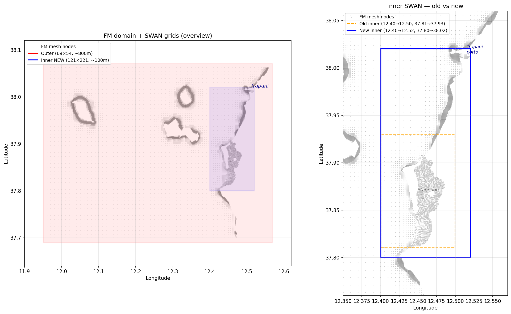<br/>
  <em>Left: FM unstructured mesh (grey nodes) overlaid with the SWAN outer grid (~800 m, pink) and the new inner nested grid (~100 m, blue) covering the lagoon proper. Right: zoom on the inner-SWAN decision — old bbox (orange dashed) sized to the lagoon, new bbox (blue) extended north to include Trapani port and offshore approaches so the inlet-approach wave field is resolved.</em>
</p>

### Water-level validation

**Inside the lagoon** — three in-situ stations (BocaNord, BocaSud, AltaVilaEst), v03c vs observed for the 9-day July 2025 window:

<p align="center">
  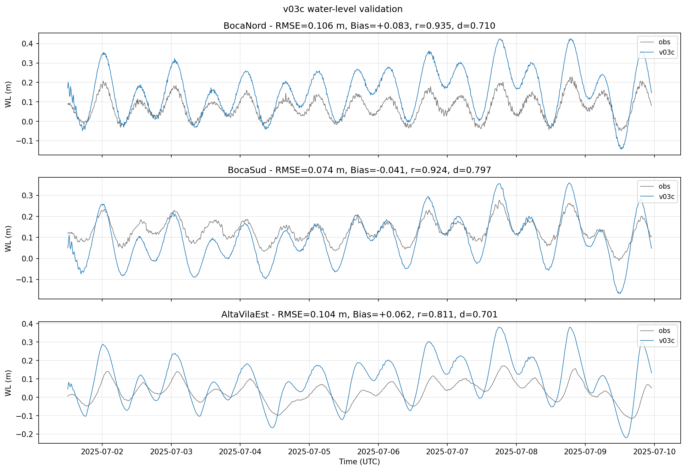<br/>
  <em>BocaNord: RMSE = 10.6 cm, r = 0.94, Willmott d = 0.71. BocaSud: RMSE = 7.4 cm, r = 0.92, d = 0.80. AltaVilaEst: RMSE = 10.4 cm, r = 0.81, d = 0.70. Model reproduces phase well; tidal amplitude is slightly overestimated (visible in peaks).</em>
</p>

**Offshore at Marettimo** (Trilha B) — ISPRA tide gauge, ~20 km west of the lagoon:

<p align="center">
  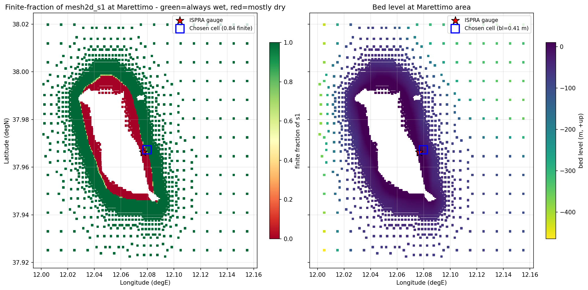<br/>
  <em>Left: fraction of time each face has a finite s1 value — green = always wet, red = drying frequently. The literal-nearest face to the ISPRA tide gauge (red star) sits at the edge of a drying ring. Right: bed level, confirming the chosen cell is at only −0.41 m.</em>
</p>

<p align="center">
  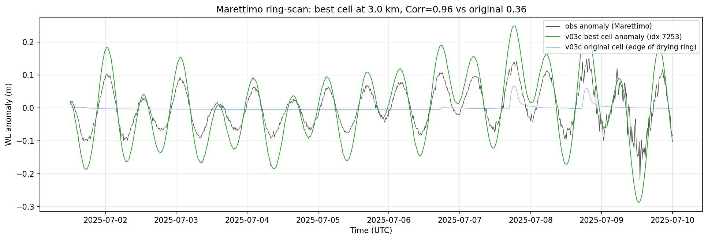<br/>
  <em>After ring-scanning 1,394 always-wet faces at 0.5–3 km offshore, the best-matching cell (green) recovers the tidal phase almost perfectly (Corr 0.95). The original literal-nearest cell (blue, at the drying edge) had flat-lined. Observed signal (black) from the JRC webcritech ISPRA gauge.</em>
</p>

Ring-scan **isolates the issue**: the CMEMS west-boundary tidal forcing propagates correctly (Corr 0.93–0.96, Willmott d 0.89 across 1,394 cells), but in v03c the model over-amplifies the tidal range by ~1.8× at this location (Std_mod 11.2 cm vs Std_obs 6.3 cm). **Resolved in v03d** by removing the `tide_tpxo80_opendap_*.bc` block from the new-format ext file: the CMEMS reanalysis WL already contains a tide signal, so superposing TPXO on the same `.pli` doubled it (`new.ext` parses repeated `[Boundary]` blocks of the same quantity additively). See [docs/deltares_modelbuilder_observation.md](docs/deltares_modelbuilder_observation.md).

A separate long-window analysis using the full 2025-01 to 2026-01 Marettimo SiAM record (55,052 samples at 10-min resolution) computed the **statistical offset anchor** δ = mean(obs) − mean(zos<sub>CMEMS</sub>) = **+0.4489 m annual** (+0.4812 m for July 2025), with monthly mean ranging from +0.36 m (Feb) to +0.50 m (Jan/26). v04 uses this anchor combined with a CMEMS MDT product (`SEALEVEL_MED_PHY_MDT_L4_STATIC_008_066`) to spread δ across the 49 PLI nodes (range +0.455 to +0.501 m). Full report in [docs/marettimo_offset_anchor_2025.md](docs/marettimo_offset_anchor_2025.md). Data fetched from JRC's [webcritech TAD server device 658](https://webcritech.jrc.ec.europa.eu/TAD_server/Device/658).

### Sediment resuspension feasibility (Trilha C1)

<p align="center">
  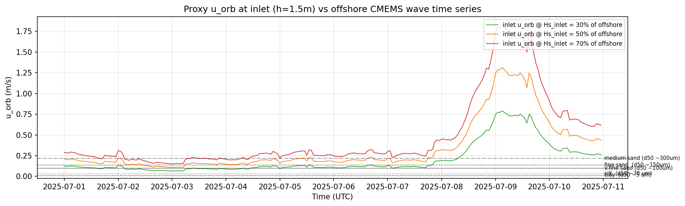<br/>
  <em>Proxy orbital velocity at the inlet (h = 1.5 m) from the offshore CMEMS wave time series, for three shoaling-attenuation scenarios. Thresholds for incipient motion of silt (0.035 m/s), fine sand (0.14 m/s), and medium sand (0.22 m/s) are crossed during the 2025-07-08/10 swell event.</em>
</p>

Three independent lines of evidence — iter-1 SWAN output (`u_orb` = 0.186 m/s at BocaNord), offshore CMEMS swell propagation, and a Sentinel-2 scene from 2025-10-06 with visible resuspension plumes — justified adding **D-Morphology**. Implemented in v04 with two fractions: sand (d50 = 150 µm) for the inlet channel, silt (d50 = 30 µm) for the lagoon interior, `MorFac=1.0`, `MorStt=1440 min` (bed update from t=1d). XBeach ruled out (surf-zone model; not applicable to a sheltered lagoon). Full analysis in [notebook 31_analysis_resuspension_feasibility](notebooks/31_analysis_resuspension_feasibility.ipynb).

### Satellite-derived bottom roughness — experimental

> **Not yet fed into the FM model.** The current v03c uses a uniform Manning baseline with optional trachytope overlay (see `model/dflowfm_v03c/roughness_satellite.xyz`); the RF-derived classification maps below are an offline experiment.

**Spectral signature QC of the training polygons** — mean reflectance ± 1σ across the 8 PlanetScope bands, for each of the four bottom classes (from `data/processed/training_polygons_03b.geojson`). Classes need to be spectrally separable before it makes sense to train a classifier:

<p align="center">
  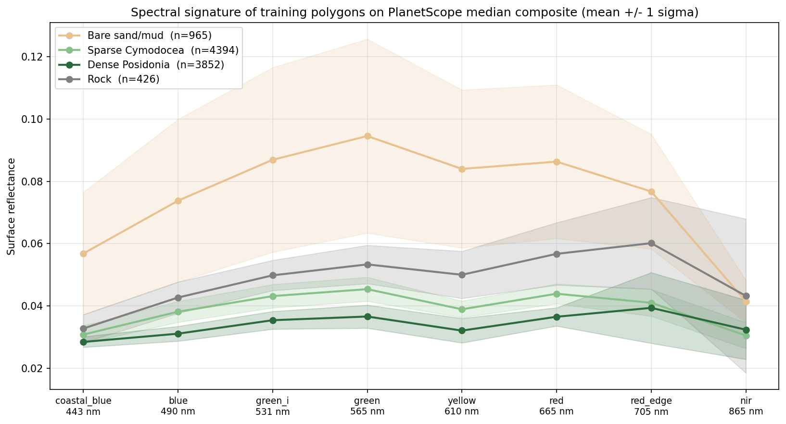<br/>
  <em>Bare sand (orange) is clearly the brightest, peaking around green–yellow. Dense Posidonia (dark green) is the darkest, with a tight envelope. Sparse Cymodocea (light green) sits in between. Rock has the widest intra-class spread (n only 426 pixels). The four curves separate well, justifying an RF over these features.</em>
</p>

**Classification maps** — Sentinel-2 baseline vs PlanetScope 8-band experiment, both over the full FM domain:

<p align="center">
  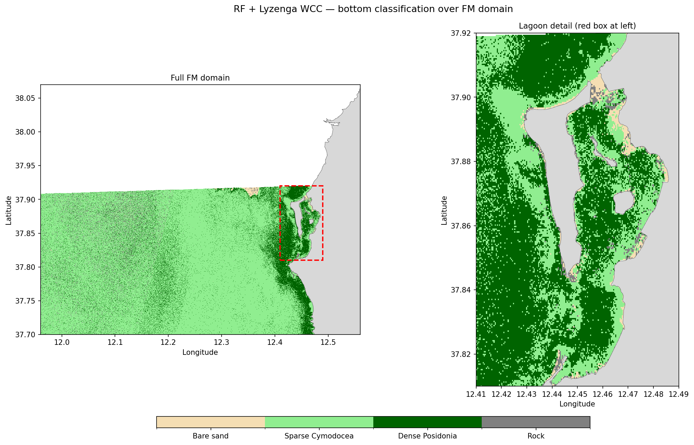
  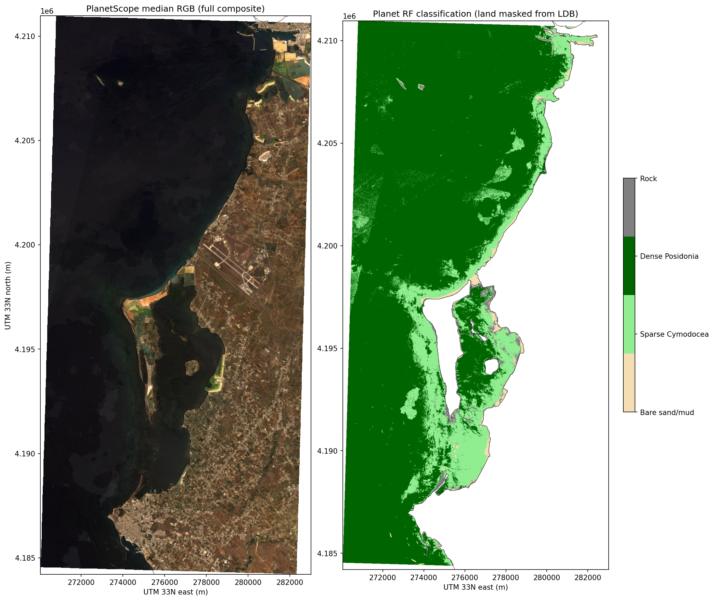
</p>

**Left:** Sentinel-2 L2A + Lyzenga water-column correction + Random Forest over the full FM domain (10 m GSD, CV accuracy ~0.9). **Right:** PlanetScope SuperDove 8-band median composite (3 m GSD, 9 dates), Lyzenga DIIs + RF, CV accuracy **0.922**. Land pixels masked from the v03 LDB coastline files.

Feature importance on the Planet pipeline shows that the four extra Planet bands (coastal_blue, green_i, yellow, red_edge) absent from Sentinel-2 carry **46 % of the classification signal**; DIIs contribute only 1–3 % each. Implication: for this scene, finer spectral sampling outperforms water-column correction. Next step: convert the classification to a spatially-variable Manning / trachytope map and feed into v03d. See [03b_roughness_alternatives notebook](notebooks/archive/03b_roughness_alternatives.ipynb).

### Hypersaline dynamics

<p align="center">
  <br/>
  <em>Interior lagoon salinity starts at 42 psu as intended (fix of v03b's <code>iniWithNudge=2</code> bug), but flushes to ~37.7 psu within ~12 hours under tidal exchange alone. Without surface evaporation the hypersaline regime is not sustainable.</em>
</p>

This drove the implementation of **ERA5 evaporation forcing** in v04, alongside relaxation of `nudgeTimeUni` from 3600 s (1 h) to 864000 s (10 d) so the lagoon-interior dynamics aren't overwritten every hour by a CMEMS-regional nudge target that doesn't resolve the hypersaline core. v04 build encountered five interlocking gotchas getting evap + D-Morph through the FM 2026.01 parser — documented exhaustively in [docs/fm_2026_gotchas.md](docs/fm_2026_gotchas.md).

### HDF5 coupling debug (Trilha D, resolved)

A five-test isolation matrix (baseline / `nc3` / `HDF5_USE_FILE_LOCKING=FALSE` / serial / `AppendCOM=true`) pinned the bug to SWAN's HDF5 re-open-for-write of `com.nc`. Only `ncFormat=3` (classic NetCDF) eliminates the error and restores time-varying waves. Trade-off: classic NetCDF has a 2 GB per-file limit — mitigated for the 9-day window with `wrimap_*` reductions and a longer `mapInterval`. Adopted from v03d onward. Full report in [docs/deltares_hdf5_coupling_report.md](docs/deltares_hdf5_coupling_report.md).

### Wave orbital velocity — spatial pattern

<p align="center">
  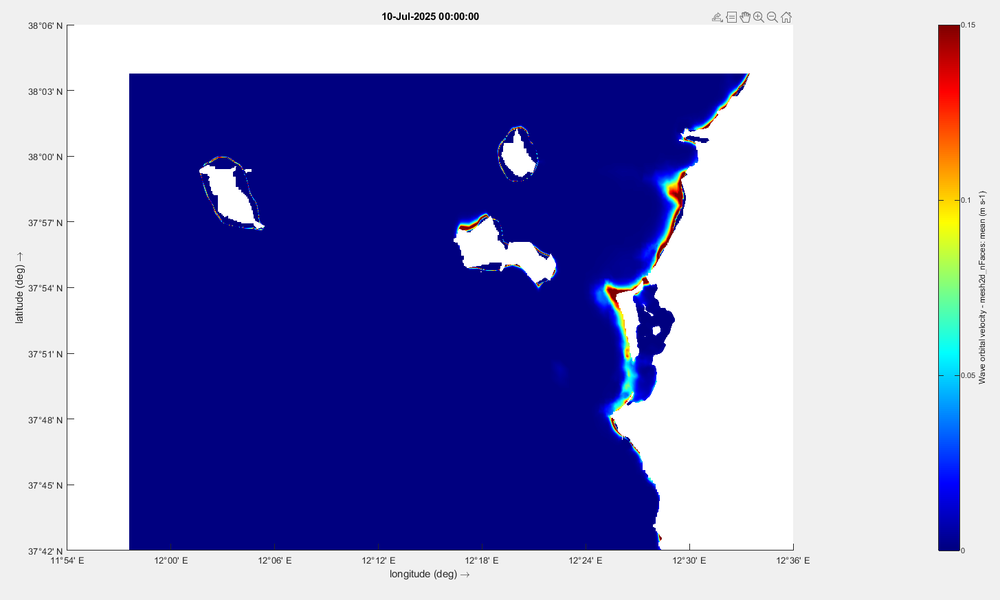<br/>
  <em>Time-mean wave orbital velocity (m s⁻¹) over the FM domain for the v03 July 2025 window. Deep-blue offshore = negligible bed interaction; warm colours trace the coast where shoaling drives u_orb above the sand-mobilisation threshold. The Egadi islands (Marettimo, Levanzo, Favignana, top-left and centre) show the same signature. This spatial pattern is consistent with the inlet-focused resuspension hypothesis and will be revisited once the HDF5 fix feeds through to time-varying wave fields in v03d.</em>
</p>

### v04 validation (Jul 1-10 2025, 9-day run)

The v04 run (per-node WL offset + Trapani mesh fix + D-Morph 2 fractions + ERA5 evaporation + nudge relaxed to 10 d) completed in ~9 h wall on 8 MPI partitions, producing 26 GB of map.nc/his.nc/com.nc/restart output. Health checks via [scripts/v04_health_check.py](scripts/v04_health_check.py); v03 vs v04 dynamic comparison via [scripts/compare_v03_vs_v04_wl.py](scripts/compare_v03_vs_v04_wl.py).

**Wave coupling — time-varying confirmed.** Significant wave height varies 0-1.5 m at 4 representative cells, capturing the 2025-07-08/09 swell event predicted by the offshore CMEMS series. The HDF5 `ncFormat=3` workaround scales to 8 MPI partitions without regression.

<p align="center">
  <br/>
  <em>v04 mesh2d_hwav at offshore-W, offshore-S, inlet-BocaNord, lagoon-centre. Calm dia 1-7 (Hs 0.2-0.4 m), storm peak ~1.5 m on day 8-9. std 0.33-0.38 m across the 4 sample cells.</em>
</p>

**Volume mass balance — +0.12 % drift over 9 d.** Total domain volume oscillates around 444 × 10⁹ m³ with M2/S2 modulation visible (~1.5 × 10⁹ m³ swing per cycle). The `mesh2d_face_z` netfile addition is confirmed working (without it, FM falls back to `bedLevUni=5 m` and reports zero volume — see [docs/fm_2026_gotchas.md](docs/fm_2026_gotchas.md) §5).

<p align="center">
  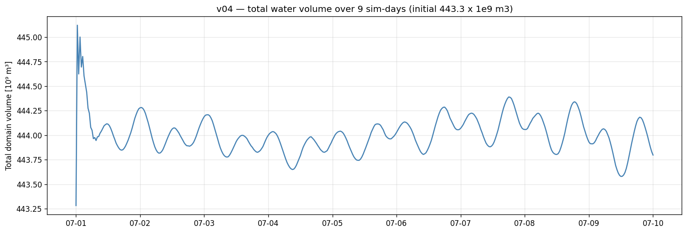<br/>
  <em>Total water volume across the FM domain. Initial 443.3 × 10⁹ m³, final 443.8 × 10⁹ m³.</em>
</p>

**Hipersaline IC preservation — partial success.** Lagoon-interior mean salinity stays at 40-42 ppt over the 9 d (compared to v03d, which eroded from 42 → 37.7 ppt within ~12 h without evap forcing). However, ~3.2 % of cells (1338 of ~25k total) develop unphysical salinities >50 ppt by day 9, concentrated on the eastern intertidal periphery (12.45-12.49 °E, 37.85-37.90 °N — the historical salt-pan area near Mozia/Trapani) and a small Trapani-port edge cluster. Cause: feedback `dS/dt = S·E/h` diverges as `h → 0` in cells with `bedlevel` between −0.6 and −0.1 m when ERA5 mer (~5 mm/d) removes water without a mechanical cap. The lagoon-mean is unaffected (area-weighted; bulk cells dominate); the diagnostic + fix candidates are queued for v04.1.

<p align="center">
  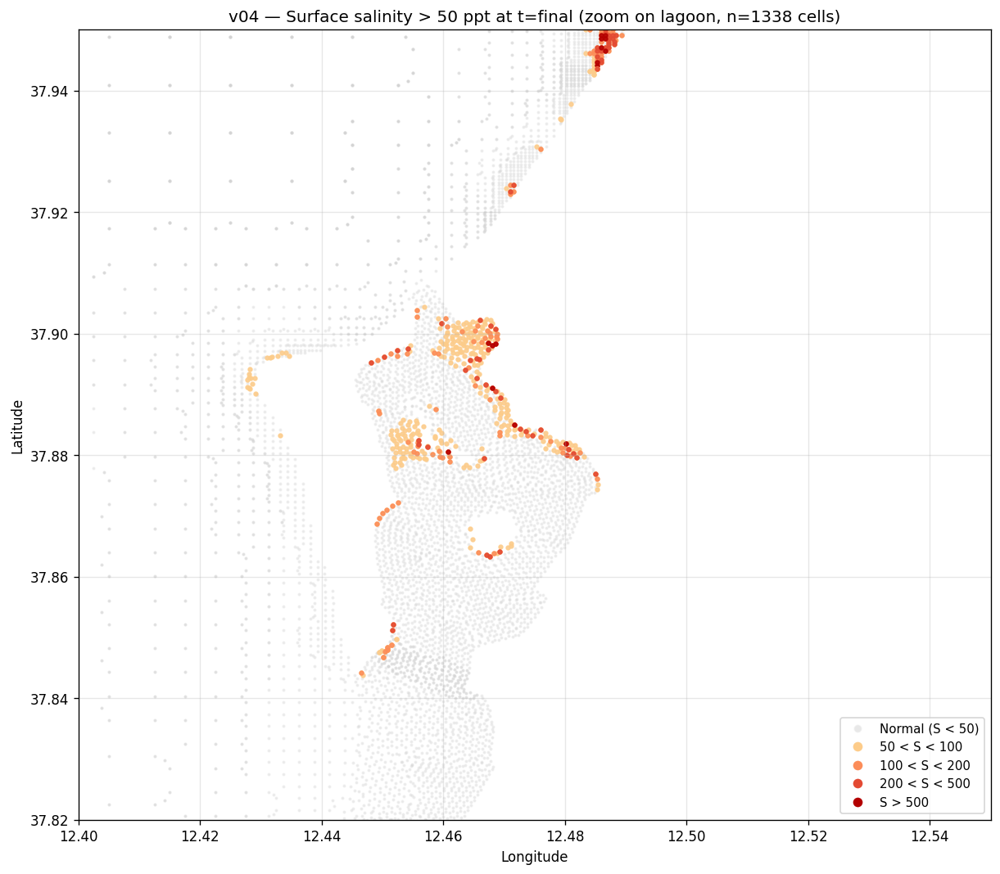50 ppt at t=final"/><br/>
  <em>Cells with surface salinity >50 ppt at the final timestep. Bulk lagoon (grey) is normal; the runaway is localised to the salt-pan periphery (east shore) and a small Trapani-port edge cluster.</em>
</p>

**WL validation post-spinup (Jul 2-10 2025).** First sim-day dropped to remove the IC spin-up transient. Three lagoon stations from his.nc + Marettimo from map.nc using the v03d-compatible cell (12.0753, 37.9747, bl ≈ −3.5 m; the literal nearest cell to the gauge picks a deep-lee-of-island position with std~0 — avoid). Both raw and mean-removed (anomaly) metrics are reported:

| Station | n | RMSE_raw | Bias | **RMSE_anom** | **Corr** | std_mod / std_obs |
|---|---|---|---|---|---|---|
| BocaNord | 1150 | 0.174 | +0.171 | **0.034** | **0.87** | 1.13 |
| BocaSud | 1150 | 0.024 | +0.008 | **0.023** | **0.92** | 1.09 |
| AltaVilaEst | 1149 | 0.133 | +0.125 | **0.043** | **0.83** | 1.29 |
| Marettimo | 385 | 0.172 | +0.167 | **0.042** | **0.80** | 1.05 |

`RMSE² = bias² + RMSE_anom²` — most of the raw error is bias (76-90 % of variance). Stripping the bias, the v04 dynamic accuracy (RMSE_anom 2.3-4.3 cm, corr 0.80-0.92) **matches or beats** v03d in the same window (post-spinup days 1.5-9: RMSE 3.4-5.2 cm, corr 0.77-0.85), with std_ratio brought from 1.30-1.65 (v03d) down to 1.05-1.29 (v04) — the tidal over-amplification at lagoon stations is essentially eliminated.

<p align="center">
  <br/>
  <em>Left: raw WL — model (orange) consistently above obs (blue) by the bias offset, especially at BocaNord, AltaVilaEst, Marettimo. BocaSud is essentially overlapping (bias +0.008 m). Right: mean-removed anomaly — the two curves match almost perfectly at all 4 stations, confirming the dynamics are good and the only issue is the absolute datum.</em>
</p>

**v03 (HDF bug + TPXO double-counting) vs v04 dynamics.** With the bias removed, v04 reduces anomaly RMSE by 49-76 % vs v03 at the lagoon stations, and brings std_ratio from ~1.95 (≈ 2× over-amplified tide) down to ~1.10 (essentially correct amplitude). This combines the effects of the TPXO BC fix (already in v03d) and the wave-coupling fix; isolating wave coupling alone would require a v04-no-waves variant which we have not built.

<p align="center">
  <br/>
  <em>v03 (grey, HDF wave bug + TPXO double-counting) vs v04 (orange) vs obs (blue) at the 3 lagoon stations. Left column: raw WL (v03 over-amplifies, v04 has higher bias). Right column: anomaly (mean removed). v04 amplitude matches obs nearly perfectly while v03 is ~2× over-amplified.</em>
</p>

**v04.1 fixes queued.** Two known issues to address before promoting v04 to a production reference:

1. **Salinity blowup mitigation.** Candidates: physics cap (`SalMax`), drying-threshold tuning (`Trsh_thresh`), evap-mask polygon over the salt-pan area, or earlier `MorStt` so D-Morph deposition can naturally fill ultra-shallow cells. Effort: 5-30 min depending on path.
2. **Datum recalibration.** Subtract ~+0.10 m from the per-node base offset (keeps the MDT spatial spread but zeros the mean lagoon-station bias). Or recalibrate against BocaSud (bias +0.008 m, the cleanest current station). Effort: 5 min.

## Roadmap

The post-v03c roadmap (six tracks A–F) and the v04 "minimum viable + ERA5 evap" build are both **complete and validated**. Current focus:

1. **WL datum recalibration** — residual +5–6 cm bias at BN/AE after VR; fine-tune per-node BC offset.
2. **D-Morph TcrEro calibration** — sweep 0.05–0.25 to bring Δbl to physically plausible values; re-enable in operational runs.
3. **v05 mesh** — resolve FM 2026.01 orthogonality issue (makeOrthoCenters or cell-deletion threshold).
4. **Paper 1 draft** — all v04AE + VR validation results ready; introduction + methods + validation sections.
5. **Multi-epoch SDB** — ≥4 Planet scenes per year for reliable Δz detection in sandy areas.

After v04.1: longer-window scenarios (multi-month, seasonal contrast) and EDITO deployment of v04AE_vr for operational-forecast mode.

## Notebook catalog

Notebooks live in `notebooks/`, organised in thematic numeric blocks (setup/input/build/valid/analysis/util). See [`notebooks/README.md`](notebooks/README.md) for the full index, per-version tree, and recommended reading order. Compact view:

| Block | Notebooks | Role |
|-------|-----------|------|
| `00–09` | `00_setup_domain_mesh`, `01_input_satellite_roughness`, `02_input_insitu_wl_wind`, `03_input_blended_wind`, `04_input_cmems_waves` | Setup + input forcing (cross-cutting) |
| `10–19` | `10_build_v01`, `11_build_v02`, `12_build_v03`, `13_build_v03_wave_coupling` | Model configuration per version |
| `20–29` | `20_valid_v01_wl`, `21_valid_v03b`, `22_valid_v03c`, `23_valid_v03c_offshore` | Run validation against in-situ / satellite |
| `30–39` | `30_analysis_v01_diagnostics`, `31_analysis_resuspension_feasibility`, `32_analysis_particle_tracking`, `33_analysis_residence_time` | Science analyses |
| `40–49` | `40_util_edito_postproc`, `41_util_edito_map_subset` | EDITO-side tooling |
| `archive/` | `03b_roughness_alternatives` (Planet 8-band experimental), `16_bocasud_investigation` | Experimental / one-off (preserved in git) |

**Convention for new notebooks**: `<NN>_<role>_<version?>_<slug>.ipynb` — role is one of `setup`/`input`/`build`/`valid`/`analysis`/`util`; version tag (`v03c`, `v04`, etc.) only when tied to a specific model revision.

## EDITO deployment

The primary execution target is EDITO Datalab (32 GiB RAM, 8 CPU, 50 GiB storage). Workflow:

```bash
# From your laptop
python scripts/edito_sync.py clean-output --yes
python scripts/edito_sync.py clean-input --yes
python scripts/edito_sync.py upload --model-dir model/dflowfm_v03c
python scripts/edito_sync.py sync-code

# On EDITO Datalab UI: New process → delft3dfm_run_docker
# The service runs `bash run_model.sh` from s3://<user-bucket>/DFM_INPUT/

# Post-processing: launch JupyterLab on EDITO, run 40_util_edito_postproc
# or 41_util_edito_map_subset to compress the 57 GB map.nc output
```

Full operational guide: [docs/EDITO_WORKFLOW.md](docs/EDITO_WORKFLOW.md)

**Critical gotcha:** every model uploaded to EDITO must include `run_model.sh` at the model root (LF line endings). Missing it yields a misleading Kubernetes `kube-root-ca.crt not registered` error. See `docs/EDITO_WORKFLOW.md` for the template.

## Setup

### Python environment

```bash
conda env create -f environment.yml -n dfm_tools_env
conda activate dfm_tools_env
python -m ipykernel install --user --name dfm_tools_env --display-name "dfm_tools (Python 3.12)"
pip install python-docx boto3   # extras for the report generator and EDITO sync
```

### Delft3D FM (local execution only — EDITO uses container)

Download [Delft3D FM Suite 2026.01 HMWQ](https://download.deltares.nl/delft3dfm) and update the path in `model/dflowfm/run_model.bat` if needed.

### Credentials

- **CMEMS** (ocean BC): https://data.marine.copernicus.eu/ — first call to `copernicusmarine` will prompt and cache login
- **ECMWF CDS** (ERA5): https://cds.climate.copernicus.eu/ — copy your Personal Access Token from the profile page; add `CDSAPI_URL=https://cds.climate.copernicus.eu/api` and `CDSAPI_KEY=<token>` to `.env` (the v04 ERA5 download script loads it via the local `load_dotenv()` helper)
- **CDSE** (Sentinel-2): https://dataspace.copernicus.eu/
- **Planet** (PlanetScope SR): https://www.planet.com/account/
- **EDITO** (Datalab S3): https://datalab.dive.edito.eu/account/storage

Copy `.env.example` → `.env` and fill the credentials. Never commit `.env` — it's in `.gitignore`.

## Reproducing results

Sequence for a fresh run:

1. **Setup env** (above).
2. **Get Delft3D FM** installed (or use EDITO).
3. **Verify reference models** exist: `oldModel/input/` (A), `oldModel/Stagnone_py_lagoon3D.dsproj_data/` (B), `oldModel/Stagnone_justLagoon/` (lagoon polygon source).
4. **Input forcing** (`00–09` block):
   - `02_input_insitu_wl_wind` → QC in-situ data → `data/processed/`
   - `03_input_blended_wind` → blended wind NetCDFs → `model/dflowfm_v02/`
   - `01_input_satellite_roughness` → Sentinel-2 roughness (optional for v02+)
   - `04_input_cmems_waves` → CMEMS wave BCs for v03b+
5. **Build model** (`10–19` block):
   - `11_build_v02` → v02 from v01 lessons
   - `12_build_v03` → v03 from v02
6. **Run**:
   - Local: `cd model/dflowfm_v02 && run_model.bat`
   - EDITO: `python scripts/edito_sync.py upload --model-dir model/dflowfm_v02`, then launch via Datalab UI
7. **Validate + analyse** (`20–39` blocks):
   - Local post-processing: `20_valid_v01_wl`, `21_valid_v03b`, `22_valid_v03c`, `23_valid_v03c_offshore`, `30_analysis_v01_diagnostics`
   - EDITO post-processing: `40_util_edito_postproc` (streams map.nc via s3fs), `41_util_edito_map_subset` (slices 57 GB → ~200 MB)
8. **Research extensions**:
   - `31_analysis_resuspension_feasibility` — u_orb diagnostics + morph justification
   - `32_analysis_particle_tracking` — OpenDrift on v03a surface currents
   - `33_analysis_residence_time` — Eulerian tracer + Knudsen

## Project structure

```
StagnoneDT/
├── notebooks/             # Main workflow (~20 Jupyter notebooks + archive/)
├── scripts/               # edito_sync.py, build_v04_offset_bc.py, regen_mesh_z_trapani.py,
│                          # add_face_z_to_netfile.py, download_marettimo_wl_long.py,
│                          # compute_marettimo_offset_anchor.py, integrate_era5_evap_v04.py, ...
├── docs/                  # progress reports, roadmaps, methodology + boundary justifications,
│                          # FM 2026 gotchas, EDITO workflow
├── model/
│   ├── dflowfm/           # v01 (baseline)
│   ├── dflowfm_v02/       # v02 (calibration fixes)
│   ├── dflowfm_v03a/      # v03a (nested SWAN + hypersaline)
│   ├── dflowfm_v03b/      # v03b (CMEMS time-varying waves)
│   ├── dflowfm_v03c/      # v03c (iniWithNudge + tracer fixes)
│   ├── dflowfm_v03d/      # v03d (TPXO BC fix, ncFormat=3, full 9d, validated)
│   └── dflowfm_v04/       # v04 (per-node WL offset + Trapani mesh + D-Morph + ERA5 evap, current)
├── data/
│   ├── raw/
│   │   ├── insitu/        # 3 WL + 2 wind station CSVs + drifters + Marettimo 13-month series
│   │   ├── cmems/         # zos at Marettimo (anchor calc) + MDT static product
│   │   ├── era5/          # ERA5 mer raw + processed for FM
│   │   ├── bathymetry/    # EMODnet 2024 patch around Trapani port
│   │   └── satellite/     # Sentinel-2 + PlanetScope 18 scenes (summer 2025, gitignored)
│   └── processed/         # QC'd data + planet composite NetCDF (gitignored) + metrics CSVs
├── oldModel/              # Reference models A & B + 2006 bathymetry (read-only)
├── reference/             # Papers, User Days materials, modelbuilder example
├── figures/               # Generated plots from notebooks (v03c validation, anchor figures)
├── environment.yml        # Conda environment spec
├── .env.example           # CMEMS / CDS / Planet / EDITO credentials template
├── .gitignore
└── README.md              # This file
```

## Critical reference files (read-only)

- `oldModel/Stagnone_py_lagoon3D.dsproj_data/Stagnone_dxy01_15m/input/Stagnone_dxy01_15m_net.nc` — primary mesh
- `oldModel/Stagnone_py_lagoon3D.dsproj_data/Stagnone_dxy01_15m/input/Stagnone_dxy01_15m.pli` — 49-point offshore boundary
- `oldModel/Stagnone_justLagoon/FlowFM_net.nc` — hand-drawn lagoon mesh (used for polygon extraction)
- `oldModel/bat_stagnone_20m_2006.xyz` — 2006 bathymetry (189K points)
- `reference/modelbuilder_example.ipynb` — dfm_tools modelbuilder template

## Publication roadmap

| # | Topic | Target journal | Status |
|---|---|---|---|
| P1 | 3D coupled wave-hydrodynamic model validation — WL, drifters, waves (v04AE) | *Ocean Modelling* / *ECSS* | **Ready to draft** — all results exist |
| P2 | Baptist VR seagrass roughness in a shallow lagoon — WL bias reduction + drifter improvement | *Coastal Engineering* / *JGR-Oceans* | Preliminary results; TcrEro calibration pending |
| P3 | Satellite RF seagrass mapping + VR integration — PlanetScope 8-band, Maltese 2025 method | *Remote Sensing of Environment* | Classification done; full VR integration remaining |
| P4 | Wave-driven sediment transport + SDB validation — D-Morph, Lyzenga ELC | *Geomorphology* / *Continental Shelf Research* | Pending TcrEro calibration + multi-epoch SDB |
| P5 | Digital-twin framework for Mediterranean lagoons on EDITO | *Environmental Modelling & Software* | Structural — after P1–P3 |

## Documentation

Per-version progress + technical reports:

- [docs/progress_report_2026-04-22.md](docs/progress_report_2026-04-22.md) — v03b → v03c debugging session
- [docs/progress_report_2026-05-04.md](docs/progress_report_2026-05-04.md) — v04 minimum-viable build day
- [docs/progress_report_v1.docx](docs/progress_report_v1.docx) — internal technical progress report (generated via `scripts/generate_report.py`)

Methodology + boundary conditions:

- [docs/wl_boundary_offset_justification.md](docs/wl_boundary_offset_justification.md) — multi-component decomposition of the +0.42 m WL offset (MDT + CMEMS bias + gauge datum + IB)
- [docs/marettimo_offset_anchor_2025.md](docs/marettimo_offset_anchor_2025.md) — 13-month Marettimo SiAM vs CMEMS `zos` anchor δ for v04 spatial offset
- [docs/deltares_modelbuilder_observation.md](docs/deltares_modelbuilder_observation.md) — observation report on the dfm_tools modelbuilder pattern (constant + tide + CMEMS doubles tide in Mediterranean)

Operational + roadmap:

- [docs/EDITO_WORKFLOW.md](docs/EDITO_WORKFLOW.md) — operational workflow on EDITO Datalab
- [docs/roadmap_post_v03c.md](docs/roadmap_post_v03c.md) — post-v03c roadmap (Trilhas A–F, complete)
- [docs/fm_2026_gotchas.md](docs/fm_2026_gotchas.md) — five interlocking parser/config gotchas encountered during v04 build (FM 2026.01)
- [docs/deltares_hdf5_coupling_report.md](docs/deltares_hdf5_coupling_report.md) — HDF5 coupling bug report + test matrix (resolved with `ncFormat=3`)
- [docs/satellite_roughness_review.md](docs/satellite_roughness_review.md) — literature review of 28 roughness papers

Validation + diagnostics scripts (run from project root):

- [scripts/v04_health_check.py](scripts/v04_health_check.py) — wave coupling + volume + salinity map + WL validation (raw + anomaly) at 4 stations
- [scripts/compare_v03_vs_v04_wl.py](scripts/compare_v03_vs_v04_wl.py) — direct WL comparison v03 (HDF wave bug + TPXO over-amp) vs v04 at the 3 lagoon stations
- [scripts/compute_marettimo_offset_anchor.py](scripts/compute_marettimo_offset_anchor.py) — long-window δ anchor against CMEMS `zos`

## License

Private repository. No license specified.
